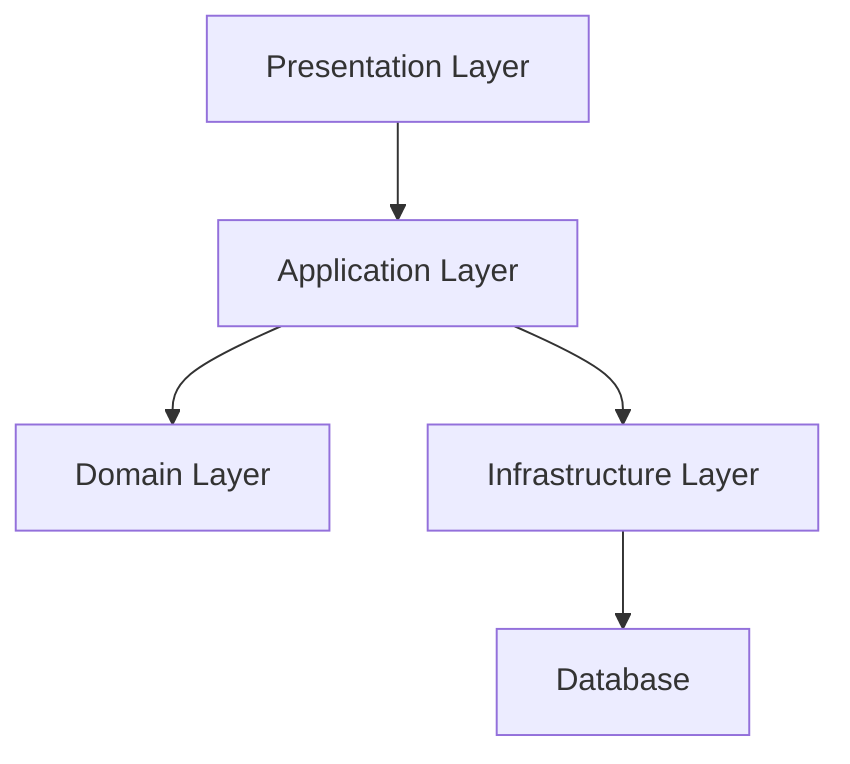

# Food-Up Server

A modular, scalable server-side application built with [NestJS](https://nestjs.com/) and TypeScript, following Domain-Driven Design (DDD) principles. The application is persistence-agnostic. The application layer includes framework dependencies to reduce development friction and leverage [NestJS](https://nestjs.com/) for dependency injection, while the domain layer remains completely pure.

---

## High-Level Architecture



- **Presentation Layer:**  
  Handles HTTP requests and responses. Contains controllers (e.g., [`BusinessesController`](src/core/businesses/presentation/rest/businesses.controller.ts)).

- **Application Layer:**  
  Contains use cases (e.g., [`BusinessService`](src/core/businesses/application/businesses.service.ts)), orchestrating domain logic and coordinating repositories.

- **Domain Layer:**  
  Defines core business entities (e.g., [`Business`](src/core/businesses/domain/business.entity.ts)), repository interfaces ([`IBusinessesRepository`](src/core/businesses/domain/businesses.repository.ts)), and business rules.

- **Infrastructure Layer:**  
  Implements repository interfaces using TypeORM ([`BusinessTypeormRepository`](src/core/businesses/infrastructure/persistence/business-typeorm.repository.ts)), data mappers ([`BusinessMapper`](src/core/businesses/infrastructure/persistence/business.mapper.ts)), and cross-cutting concerns like logging ([`LoggerModule`](src/shared/infrastructure/logger/logger.module.ts)).

---

## Key Modules

- [`CoreModule`](src/core/core.module.ts): Aggregates all feature modules.
- [`BusinessesModule`](src/core/businesses/businesses.module.ts): Business domain logic and endpoints.
- [`EmployeesModule`](src/core/employees/employees.module.ts): Employee domain logic and endpoints.

---

## Getting Started

### Installation

```bash
npm install
```

### Running the App

```bash
# development
npm run start

# watch mode
npm run start:dev

# production mode
npm run start:prod
```

### Testing

```bash
# unit tests
npm run test

# e2e tests
npm run test:e2e

# test coverage
npm run test:cov
```

---

## Project Structure

- `src/core/` — Feature modules (businesses, employees, etc.)
- `src/shared/` — Shared abstractions and infrastructure (logger, repository, etc.) - Cross cutting concerns
- `src/app.module.ts` — Root application module
- `src/env.validation.ts` — Environment variable validation

---

## License

MIT
