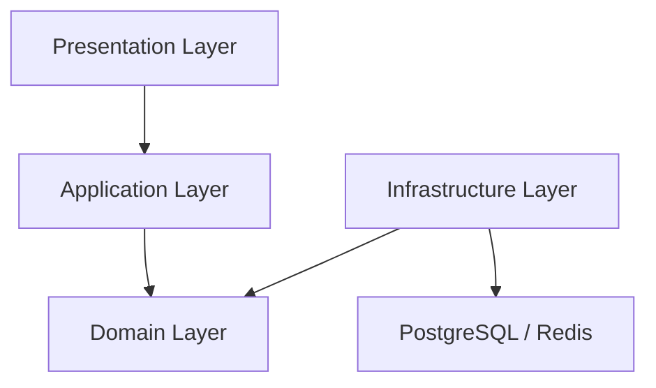

# Food-Up Server

NestJS REST API for the Food-Up platform. Runs on port **3000**. API documentation is available at `/api/docs` (Swagger UI) when the server is running.

The backend follows **Domain-Driven Design (DDD)** with strict layer separation enforced by ESLint. The domain layer has zero framework dependencies; NestJS is used only in the application layer and above.

---

## Architecture

### Layer Diagram


```mermaid
graph TD
    A[Presentation Layer] --> B[Application Layer]
    B --> C[Domain Layer]
    D[Infrastructure Layer] --> C
    D --> E[PostgreSQL / Redis]
```

### Layer Responsibilities

| Layer | Location | Responsibility |
|---|---|---|
| **Presentation** | `presentation/rest/` | Controllers, request/response DTOs, Swagger decorators |
| **Application** | `application/` | Use-case services, orchestrates domain + repositories |
| **Domain** | `domain/` | Entities, repository interfaces, domain events — zero framework imports |
| **Infrastructure** | `infrastructure/` | TypeORM entity mappings, repository implementations, mappers |

ESLint (`eslint-plugin-boundaries`) enforces that no inner layer imports from an outer layer. A violation is a build error.

---

## Feature Module Structure

Every feature under `src/core/[feature]/` follows this canonical layout:

```
[feature]/
├── domain/
│   ├── [feature].entity.ts                     # Pure domain entity
│   ├── [feature].repository.interface.ts        # IRepository interface + DI symbol
│   └── events/                                  # Domain events (optional)
├── application/
│   ├── [feature].service.ts                     # Use-case orchestration
│   ├── dto/                                     # View-model DTOs (application layer)
│   └── queries/                                 # Query repositories (read-heavy views)
│       ├── [feature]-query-repository.interface.ts
│       ├── [feature]-query.service.ts
│       └── dto/
├── infrastructure/
│   └── persistence/
│       ├── [feature].typeorm-entity.ts           # TypeORM @Entity
│       ├── [feature]-typeorm.repository.ts       # IRepository implementation
│       ├── [feature].mapper.ts                   # Domain ↔ TypeORM mapping
│       └── [feature]-query-typeorm.repository.ts # Query repository implementation
└── presentation/
    └── rest/
        ├── [feature].controller.ts
        └── dto/                                  # Request/response DTOs (class-validator)
```

---

## Feature Modules

| Module | Description |
|---|---|
| `auth` | JWT authentication, login/register, Passport strategy |
| `businesses` | Company/business management, multi-tenant root |
| `business-invites` | Invite employees to a business via email |
| `business-suppliers` | Associate suppliers with a specific business |
| `change-requests` | Employee change request workflow (pending → approved/rejected) |
| `employees` | Employee records, roles, and profile management |
| `identity` | Identity accounts (decoupled from employee/supplier records) |
| `meals` | Meal definitions (name, type, description) |
| `meal-selections` | Employee meal selections for a given day |
| `meal-selection-windows` | Time-bounded windows during which employees can select meals |
| `menu-items` | Items on a supplier's menu (meal + supplier + period association) |
| `menu-periods` | Date ranges defining when a supplier's menu is active |
| `reports` | Aggregated meal selection reports for managers |
| `suppliers` | Supplier management (food vendors) |

Cross-cutting infrastructure lives in `src/shared/`:

| Module | Description |
|---|---|
| `shared/domain` | `Entity` base class, `IRepository` interface, domain event bus |
| `shared/application` | `ITransactionRunner` interface |
| `shared/infrastructure` | Logger (Pino), TypeORM base repository, transaction runner implementation |

---

## Key Patterns

### Entity Pattern

Domain entities have a **private constructor**. Creation goes through static factory methods:

```typescript
export class Business extends Entity {
  // Use when creating a new Business for the first time.
  // Generates a new ID and may emit domain events.
  static create(name: string, contactEmail: string): Business {
    return new Business(generateId(), name, contactEmail);
  }

  // Use when rehydrating from the database.
  // No events, no side-effects.
  static reconstitute(id: string, name: string, contactEmail: string): Business {
    return new Business(id, name, contactEmail);
  }

  private constructor(
    private readonly id: string,
    public name: string,
    public contactEmail: string,
  ) {
    super();
  }
}
```

Never call `new Business(...)` directly outside the entity file.

### Repository Pattern

The domain layer defines the interface and the DI symbol; the infrastructure layer provides the implementation.

**Domain** (`domain/businesses.repository.interface.ts`):
```typescript
export const I_BUSINESSES_REPOSITORY = Symbol('IBusinessesRepository');

export interface IBusinessesRepository extends IRepository<Business> {}
```

**Module** (`businesses.module.ts`):
```typescript
{
  provide: I_BUSINESSES_REPOSITORY,
  useClass: BusinessTypeormRepository,
}
```

**Service injection** (`businesses.service.ts`):
```typescript
constructor(
  @Inject(I_BUSINESSES_REPOSITORY)
  private readonly _repository: IBusinessesRepository,
) {}
```

### Query Repository Pattern

Use a **query repository** when a read operation joins multiple entities or returns a shaped DTO that doesn't map to a single domain entity. Do not add these methods to the main domain repository.

```
application/queries/
  [feature]-query-repository.interface.ts    # Symbol + interface, returns plain DTOs
  [feature]-query.service.ts                 # Thin @Injectable service

infrastructure/persistence/
  [feature]-query-typeorm.repository.ts      # QueryBuilder + getRawMany impl
```

Use when:
- The response joins multiple entities (e.g. employee name + meal details in one row)
- The result is read-only — no insert/update/delete
- The shape doesn't fit a single domain entity

Use the main domain repository when loading an entity that will be mutated or for simple `findById` / `findByCriteria` lookups.

Query repositories use `createQueryBuilder` + `getRawMany` with explicit `SELECT` aliases and always respect `TransactionContext` (same pattern as the main repository's `_repository` getter).

### Transaction Runner

Services that need to coordinate multiple repository writes use `ITransactionRunner`:

```typescript
constructor(
  @Inject(I_BUSINESSES_REPOSITORY)
  private readonly _repository: IBusinessesRepository,
  private readonly _transactionRunner: ITransactionRunner,
) {}

async doSomething() {
  await this._transactionRunner.run(async (context) => {
    await this._repository.save(entity, context);
    await this._otherRepository.save(other, context);
  });
}
```

### Guards and Decorators

| Decorator | Effect |
|---|---|
| `@Public()` | Skip JWT authentication for this endpoint |
| `@CurrentIdentity()` | Inject the JWT payload into the handler parameter |
| `@EmployeeRole(EmployeeRole.Manager)` | Require a specific employee role |
| `@IdentityType(IdentityType.Employee)` | Require a specific identity type |
| `@DisabledInProduction()` | Block the endpoint in production |

JWT auth is applied globally via `JwtAuthGuard`. Use `@Public()` to opt out.

---

## Background Jobs (BullMQ)

Email notifications are processed asynchronously through a **BullMQ** queue layer backed by Redis. This decouples notification delivery from the HTTP request cycle and gives automatic retries on failure.

### Flow

```
Domain Event (EventEmitter)
    → Event Handler (@OnEvent)
        → BullMQ Queue (Redis-backed)
            → Processor (WorkerHost)
                → Email (Resend)
```

1. A **domain event** is emitted inside a service after a state change (e.g. a meal selection window is opened).
2. An **event handler** (`@OnEvent`) listens for it and enqueues a job.
3. A **processor** (`WorkerHost`) picks up the job and performs the side-effect (sends email).

This means HTTP responses are never delayed by email delivery, and failed sends are automatically retried by BullMQ.

### Queues

All queue names are constants in `src/shared/infrastructure/notifications/queue-names.ts`:

| Queue name | Constant | Purpose |
|---|---|---|
| `meal-window-notifications` | `MEAL_WINDOW_QUEUE` | Notify all employees when a selection window opens |
| `window-deadline-notifications` | `WINDOW_DEADLINE_QUEUE` | Notify employees when a selection window is about to close (delayed job) |
| `change-request-notifications` | `CHANGE_REQUEST_QUEUE` | Notify an employee when their change request is approved or rejected |
| `bulk-change-request-notifications` | `BULK_CHANGE_REQUEST_QUEUE` | Notify employees after a bulk status update (grouped by employee) |

### Processors

All processors live in `src/shared/infrastructure/notifications/processors/`. Each extends `WorkerHost` and implements `process(job)`:

| Processor | Queue | What it does |
|---|---|---|
| `MealSelectionWindowOpenedProcessor` | `MEAL_WINDOW_QUEUE` | Emails all eligible employees for the business; uses Redis keys to deduplicate sends within a 1-hour cooldown |
| `MealSelectionWindowDeadlineProcessor` | `WINDOW_DEADLINE_QUEUE` | Emails employees a reminder that the selection window is closing |
| `ChangeRequestStatusProcessor` | `CHANGE_REQUEST_QUEUE` | Emails one employee about their individual change request status |
| `BulkChangeRequestStatusProcessor` | `BULK_CHANGE_REQUEST_QUEUE` | Emails one employee a summary of all their change requests updated in a bulk action |

### Delayed Jobs

The deadline notification uses BullMQ's `delay` option to schedule the job to run at the exact moment the window closes:

```typescript
await this._deadlineQueue.add(
  'notify-deadline',
  { mealSelectionWindowId },
  {
    jobId: mealSelectionWindowId,  // replacing any existing job for this window
    delay: new Date(endTime).getTime() - Date.now(),
  },
);
```

Using the window ID as `jobId` ensures that if the window's end time is updated, the old delayed job is replaced rather than duplicated.

### Redis Roles

Redis serves two purposes in the notifications layer:

| Role | Used by |
|---|---|
| BullMQ job store | All queues (queue state, job data, retry bookkeeping) |
| Deduplication / cooldown keys | `MealSelectionWindowOpenedProcessor` (prevents re-sending emails on rapid window updates) |

All queue and notification infrastructure lives in `src/shared/infrastructure/notifications/`.

---

## Running the Server

From the **monorepo root** (recommended, compiles shared library too):
```bash
npm run dev:server
```

From `apps/server/` directly:
```bash
npm run start:dev
```

### Environment Variables

| Variable | Description | Notes |
|---|---|---|
| `DB_HOST` | Postgres host | |
| `DB_PORT` | Postgres port | |
| `DB_USER` | Postgres username | |
| `DB_PASSWORD` | Postgres password | |
| `DB_NAME` | Database name | |
| `NODE_ENV` | `development` or `production` | |
| `ORM_SYNC` | Auto-sync schema | Set `true` in dev only — never in prod |
| `REDIS_HOST` | Redis host | |
| `REDIS_PORT` | Redis port | |
| `WEB_APP_URL` | Frontend origin URL | Used for CORS and email links |
| `MAIL_FROM` | Email sender address | |
| `RESEND_API_KEY` | Resend transactional email API key | |

Validation happens at startup via `env.validation.ts`. The server will refuse to start if required variables are missing or have the wrong type.

---

## Database

- **PostgreSQL 17** with TypeORM 0.3
- **SnakeNamingStrategy**: TypeORM entity fields in camelCase are automatically mapped to `snake_case` columns
- TypeORM entities are loaded by glob (`*.typeorm-entity.*`) — new entities are picked up automatically
- Set `ORM_SYNC=true` in dev to auto-apply schema changes. Never use this in production

### Seeding

```bash
npm run seed --workspace=apps/server -- \
  --manager-email=admin@example.com \
  --manager-password=yourpassword
```

---

## Testing

```bash
# Unit tests
npm run test --workspace=apps/server

# Unit tests in watch mode
npm run test:watch --workspace=apps/server

# Coverage report
npm run test:cov --workspace=apps/server

# E2E tests
npm run test:e2e --workspace=apps/server
```

---

## API Documentation

Swagger UI is available at **http://localhost:3000/api/docs** when the server is running.

All controller methods must include Swagger decorators:
```typescript
@ApiOperation({ summary: 'Get a business by ID' })
@ApiResponse({ status: 200, type: BusinessResponseDto })
@ApiResponse({ status: 404, description: 'Business not found' })
```

Response DTOs use `@Exclude()` strategy — fields must be explicitly `@Expose()`d or they will be omitted from the response.

---

## Naming Conventions

| Pattern | Example |
|---|---|
| Private fields | `_prefixedWithUnderscore` |
| Interfaces | `IPrefixedWithI` |
| DI tokens | `I_SCREAMING_SNAKE_CASE` (Symbol) |
| Files | `kebab-case.purpose.ts` |
| DTOs | `PascalCaseResponseDto`, `PascalCaseRequestDto` |
| TypeORM entities | `PascalCaseTypeOrmEntity` |
| Domain entities | `PascalCase` (no suffix) |
